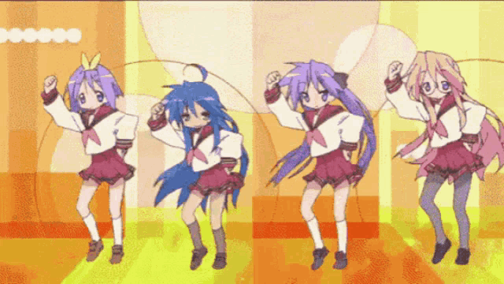

<h1>
  <picture>
    
  </picture>
</h1>

Dot-Stuff is a small Haxe team aimed towards a more convenient future, integrating some of the former glory of Flash and pushing Haxe to more competitive fields.

Founded by Dot-With with the creation of the Friday Night Funkin' mod engine [Dot-Engine](https://github.com/Dot-Stuff/Dot-Engine), Dot-Stuff would be later recognized thanks to [FlxAnimate](https://github.com/Dot-Stuff/flxanimate), a Haxelib designed to play a limited subset of what the Small Web Format offered in a JSON format called Texture Atlas, first integrated in Adobe Animate 2018.

Right now, our goal is to further develop FlxAnimate thanks to [Better Texture Atlas](https://github.com/Dot-Stuff/BetterTextureAtlas), an extension of the original exporter, which fixes errors and adding more functionality and more data to further shrink the size of the Texture Atlas itself, and in the process, embrace the nature of Haxe in our workflow completely.

